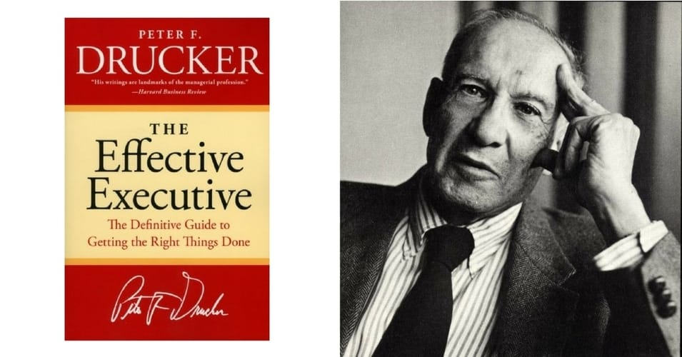

# 简介

今年我给自己立下得到flag包括了阅读完十几本书，以提升自己的认知和视野。《卓有成效的管理者》是我在2024年1月中旬开始看的一本书。之所以选择阅读这本书，是因为当初翻阅内容、在豆瓣上看书评时，许多人的阅读笔记记录的思考确实对我比较有启发，怀着这样的好奇心，我打开了这本书。

这也是我第一次写读书笔记。为了push自己总结这本带给自己足够多启发的书，我将按照书的目录（因为目录本身足够富有逻辑）和自己的理解思考展开读书感想。

# 什么是有效？为何须有效？

所谓的“有效”，是**做好正确的事**，对组织尽可能作出多的、好的贡献。对于一个研究生来说，组织既可以是自己的学术生涯或职业发展生涯，或者是导师和课题组，也可以是学校或者学术界该领域的圈子。自己的有效性就在于选择最有价值的课题，高质量并快速地调研、开展复现和实验，并完成论文撰写和投稿。

书中提到，有效管理者之间的共同点，就是他们有一些做法能够让手上资源和自身能力变得有效。一个人不管多么聪明、多么刻苦、多么有想象力、多么有知识，只要不遵循这些做法，就会成为无效的管理者。这一点让我想到，自**己长期以来处于一个“眼高手低”的状态，一个畏首畏尾不够勇敢行动的状态。所以千万要记住，只有真正将自己的idea付出有效行动、提升有效执行力的时候，自己的有效性才能够充分发挥出来。**这一点是需要继续实践的，做一个勇敢的人，以做出结果、自我认知成长为目标，抛弃所有顾虑和害怕，才能成长得充分、快速。

除了有效执行力的提升以外，还需要注意有效是关注个人与外部的交互的，而非对内部负责的。这有两层含义，第一，**不能内耗**；第二，**要分清主次问题**。从个体层面来讲，内耗体现在自己沉溺于负面情绪无法自拔，也体现在沉溺于过去，将时间浪费在消耗自己的创造力和思维，并沉溺于解决过去的、对未来发展毫无必要的问题上；从家庭层面来讲，一个家庭无论处于上升期还是低谷期，只有停止一切的内部消耗（例如吵架、人情小事、攀比等），加强一致对外的团结合作，才能使得整个家庭摆脱困境，不断向上发展。此外，一个有效的目标并不意味着只能完成对这个目标有益的事情而忽略了别的方面的平衡。例如，自己为了产出足够多学术成果，就牺牲自己的睡眠和健康，缺乏锻炼。换句话说，有效性更关注于一个目标的长远效应，如果不能够将自己的目标放的长远，会在更长的时间维度上使得有效性变差。

从自己最近的学习生活启发来讲，**不能内耗，要求自己时刻观察自己的情绪，注意远离任何可能产生负面情绪的事物**（比如谁谁谁又在写论文、中paper了、实习大厂了），同时又需要**保持无条件的自我价值感（只要自己评价自己的行为符合有效性准则，那么别人无论如何看我，皆无意义**，并且还要积极利用好人际关系达成自己的目标）以及勇敢的心（不断去尝试、犯错，去高效吸收知识和思考，才能最大程度发挥自己的青春，得到在专业领域的发展）。一切都要来源于，不怕！

有效性这个概念既是本书的核心论证目标，也是对自己启发最大的一个概念。这个概念给予了自己拨开迷雾看清目标，解决了内驱力不足、倾向于浪费时间躲避问题的根本难题。这一个思想需要贯彻到底。

# 有效管理的五个要素

> 要想成为有效管理者，必须学会五种惯常做法，或者说在思想上养成五种习惯。
>
> 1. **有效管理者清楚自己的时间花在哪里**。他们系统地管理自己那为数不多的自主可控的时间。
> 2. **有效管理者关注对外的贡献**。他们努力取得成果，而不是只为完成工作。他们总是先问：“哪些成果是我理当提供的？”而不是先考虑要做哪些工作，更不是想工作需要使用哪些方法和工具。
> 3. **有效管理者以长处立身处世**。这里说的长处，包括他们自己的长处，还有上司、同事和下级的长处，以及情境中的有利因素，即他们在当时形势下能去做的事。他们不会把短处作为基础，也不会从自己不能去做的事上入手。
> 4. **有效管理者聚焦在少数几个重要领域**。他们会找出有限的几个重要领域——只要在这些领域表现出色，就可以取得杰出的成果。他们会迫使自己明确优先任务，并在实际工作当中严守这个优先次序。他们知道自己别无选择，必须要事优先，不在次要的事情上浪费精力，否则就会一事无成。
> 5. **有效管理者作出有效的决策**。他们知道这首先是一个体系，也就是要以正确的顺序完成一系列正确的步骤。他们也知道，有效的决策总是建立在“不同观点”之上的判断，而不是建立在“基于事实的共识”之上的判断。他们还知道，快速作出很多决策势必出错。他们真正需要作出的是为数不多但意义重大的决策；需要的是指定正确的战略，而不是提出让人眼花缭乱的战术。

## 时间管理

有效管理需要对时间进行审视，再进行时间管理。

有效的管理者首先做的不是制定工作计划，而是弄清楚自己的时间都花在了什么地方。然后，他们努力管好自己的时间，拒绝那些不会带来成效的时间要求。最后，他们把自己的“可支配时间”集中成尽量大块的连续时段。这个三步法包括：

- 记录时间
- 管理时间
- 集中时间

第一个观点：**想要取得有效性，对于知识工作者而言，必须要有大块的时间可供利用。**每个人的时间必然会浪费在一些看似不得不做，其实贡献很少，甚至毫无贡献的事情上面。但是，管理者要想取得最起码的有效性，大部分任务是需要用整块的时间去完成的。**每次投入的时间如果少于某个最低值，就会是纯粹的浪费。**（如果**思维活动**被频繁打断，做了不如不做）因为，如果什么结果都还没做出来就中断，那么下次又得从头再来。（对我自己而言，一个半小时的大块时间应该不能受到任何的干扰，除非非常紧急。）

> 比方说，如果起草一份报告至少需要6-8小时，那么每个工作日花上两个15分钟，持续3周，于是累计时间超过7小时，但可能还是毫无意义，最终得到的东西除了一些信手的涂鸦之外，其他什么也没有。但如果关上门，切断电话，在不被打断的情况下熬上五六个小时，倒是有可能写出一份我所说的“零稿”，也就是初稿之前的版本，有了这个基础，后面再花一些零碎的时间，对稿子逐章逐段逐句地重写、订正和润色，也就可以了。
>
> 做实验也是如此。第一次必须连续奋战5-12小时，把设备调试好，至少从头到尾做一次。如果中间被打断，就不得不从头开始。

看论文实际上也是一样的，如果一篇文章不能一次性从头到尾了解大概，那么如果从头到尾读，很容易一次性读不完，进而被打断思路，后来又需要从头读过，非常浪费时间。所以，一定要从头到尾初步看篇章结构、看完图片以及相应主要论述，在初步建立思维图框之后，再按照有效性目标进行选择性细读。

第二个观点：有效管理需要对自己的时间进行记录，每过一段时间进行回顾，最少也是连续记录3、4周，每年定期做两次。

第三个观点：在基于对自己时间的有效记录后，系统性地管理时间。**管理者要那些没有成效和浪费时间的活动找出来，尽最大努力把它们砍掉。**

- 首先，要找出并砍掉那些根本不需要做的事，也就是那些不会产生任何成果，纯属浪费时间的事情。具体的做法是，针对时间记录表上的所有活动，逐项提出这个问题：“这件事如果完全不去做，会产生什么后果？”如果答案是“什么后果也不会有”，那么结论显然就是停止做这件事。
- 其次，需要回答的问题是“我时间记录表上的哪些活动，是别人同样可以 做好，甚至做得更好的？”把非自己不可的事情扔给可以替代的人。
- 最后，还要注意到管理者造成他人的时间浪费。思考“我做的哪些事，对你的有效性没有贡献，所以是浪费你时间的？”

砍掉不必要的事项可能会引起一个疑虑，担心误伤重要事项。但是实际上，如果真的发生了误伤，也会很快得到纠正。

这里非常重要的一个有关时间管理的步骤就是**精简浪费时间的因素和活动**，并**集中“可自由支配的时间”**。

首先需要认识到，可以自由支配的时间不会太多——无论管理者多么坚决地精简那些浪费时间的活动。对于高层管理者来说，自己真正可以支配和用于处理重要事项的时间，也就是可以用于处理那些真正有助于做出贡献和属于本职工作的事情的时间，极少超过其工作时间的1/4。

因此，有效管理者知道必须把自己的可支配时间集中起来。他明白自己需要的是整块的时间，而时间变得支离破碎便全无用处。一天的工作时间只要有哪怕1/4能够集中成几大块，通常就足以去完成那些重要的事情，但如果都是这里15分钟、那里半小时这样的碎片，就算综述达到一天的3/4，那也没有什么用处。

有些人的做法是，一周安排两天（例如周一和周五）处理各种日常工作，例如开会、审核、讨论问题等，把另外几天的整个上午留出来，连续不断地处理重要事项。在这个的基础上，按照个人的精力好好分配时间，比如上午大脑的思维最清晰，所以最适合做高思维量的工作（思考技术框架、大脑构建思维图、做一些输出性的内容、阅读论文、写代码等），下午适合做一些社交、与人打交道的工作，比如开会、交流进度等，或者稍微思维量少的活动（读paper等）。晚上适合运动、散步，思考idea，看论文等。

在时间管理上，总的来说，需要做到保持记录时间（保持精准、事项内容清晰）、剔除无效时间、保证大块时间集中于最重要优先的事项。

## 要事优先，一次只做一件事

有效性若有任何“秘诀”可言，那就是**聚焦**。有效管理者**总是先做重要的事，而且每次只做一件**。

管理者越是努力让长处富有成效，就越清楚有必要**把所有可用的长处聚焦于抓住重要机会**，这是取得成果的唯一途径。

聚焦之所以有必要，原因正是管理者迫切需要完成的任务实在太多，而**每次只做一件事就可以做得更快**。相比于并行化处理，集中于一件事并一件一件做下去，二者实际需要的工作量是相同的，但是每次只做一件事会使得工作量更快完成，且做得更连贯、有效，这样就使得总的耗时变少。这正是一种**系统性的视角来使用自己的时间**。

### 抛弃昨天

管理者聚焦的首要法则，是抛弃那些已经不再有成效的旧事。有效管理者会定期检视自己和同事的工作计划，思考：“假如这件事不是已经在做，**现在**还会去做吗？”除非答案是无条件的“是的”，否则他们就会停止这项活动或者大幅减少投入。管理者至少可以停止那些不再有希望带来成果的旧活动和旧任务，从而努力减少旧事的束缚。

### 优先任务和延迟任务

优先任务不能被压力所决定。要始终以“正确”、“有意义”作为任务是否优先的判断标准。

除了优先任务的确定外，还需要做到延迟任务的确定，也就是决定哪些事情不去做，并严守这个决定。区分优先任务和延迟任务，最重要的不是高超的分析，而是勇气。

设定优先任务需要遵循一些真正重要的法则，对这些法则起决定作用的因素是勇气，而不是分析。这些法则包括：

- 重视将来，而不是重视过去
- 专注于机会，而不是专注于问题
- 选择自己的方向，而不是随波逐流
- 目标高远，做可以带来不同的事，而不是但求“安全”，做容易的事

有效管理者会**全力以赴去完成当前聚焦的那一项任务**。在完成该任务之后，再对形势进行评估，确定接下来哪一项任务最重要。

**聚焦就是有勇气对什么是真正重要和优先的事项做出自己的决策**，并据此使用自己的时间。它是管理者成为时间和任务的主人，而不受其驱使的唯一希望。

## 决策的要素

1. 一个决策应当是面向共性的问题，并建立规则和原则，以此避免多个问题的冲突。
2. 定义解决方案需要满足的参数，即“边界条件”。这使得决策是具体的、可行的。
3. **先**想清楚什么是“正确的”，即满足各种边界条件的参数和方案。然后再结合现实，思考让人接受决策需要做出哪些妥协、调整和让步。
4. 把落实决策所需要采取的行动也融进决策。
5. 建立“反馈机制”，用事情的实际发展情况检验决策的有效期和有效性。

# 其他观念

人要学会发挥自己的长处而非短处，相比于规避短处，应该更多思考如何将自己的长处变成核心竞争力，除非规避短处是为了使得长处的发挥所需要的短板得到补全。

# 总结

这本书其实发现得挺偶然的，当时只是随便在豆瓣上看到有人分享另一本什么书，然后沿着这本书点着点着就进去了新的页面，然后就发现了这本书。事实上，这本书对我最近一段时间的影响非常大，至少从认知方面造成了巨大的改变和革新。笔记记录至此，我仍然觉得很多知识点没有吸收，或者说有的观点我认可但是还没有付诸足够的时间。希望记录此文以共勉！

