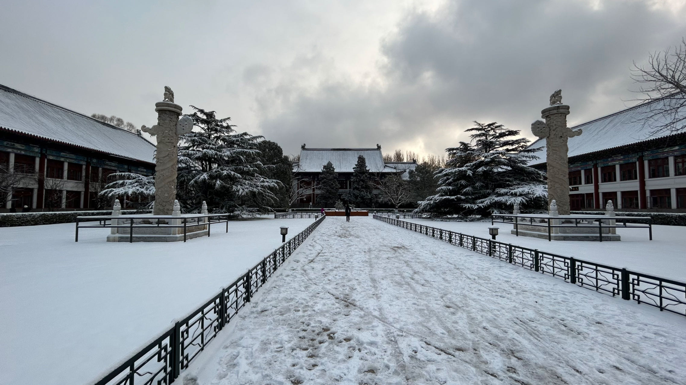
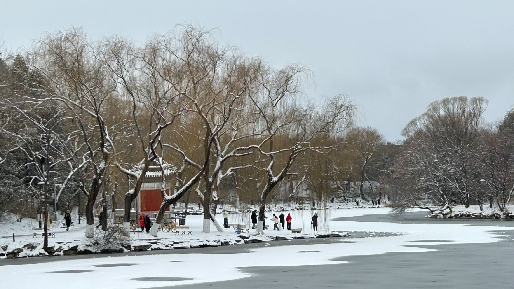

2023年12月11日，北京下了今年的第一场雪。

以后将成为长期流放昌平的苦命人，我必然得抓住难得的机会去燕园看一次雪。

“红楼飞雪，一时英杰”，红楼虽在东城沙滩，但传说的魅力从不止步于一隅。从西门进入到校友桥头，贝公楼外一片宁静祥和。

校友桥下湖光潋滟，今日之景格外清澈，无雪风吹皱一池冬水，只留人在水上映衬嬉游。

自西而东，步行至未名湖畔。与一月前来见，湖畔昔时之碧空青草倒树立天已不显踪迹，上下一白，与游人同学共见证2023的雪景。

慈济寺门前行人有十余，立于中央的是酷似微笑胖娃娃的雪人。

沿湖而行，走到观瞻博雅塔的最佳视角。不少同学和我一样在此处拍摄。希望留下燕园在此刻最优雅宁静的模样。

接着，我来到了湖心岛，在石舫前端，我留下了自己在燕园的印记——与博雅塔的冬日合影（非常感谢摄影的同学，整个构图算是非常合适了）。

简记于此，以记录燕园初雪之行。期待与燕园的未来五年，能与时光雕刻我的学术理想。

