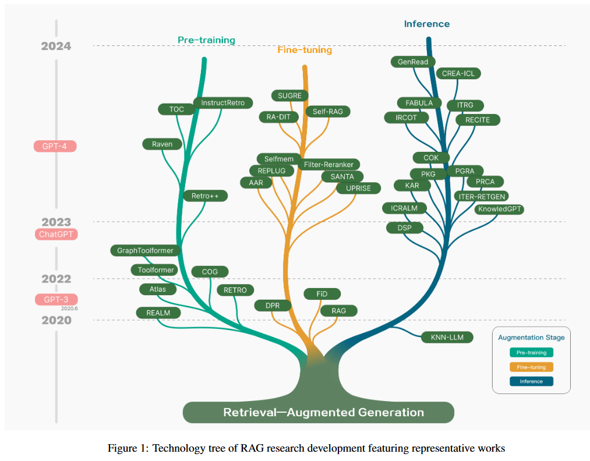
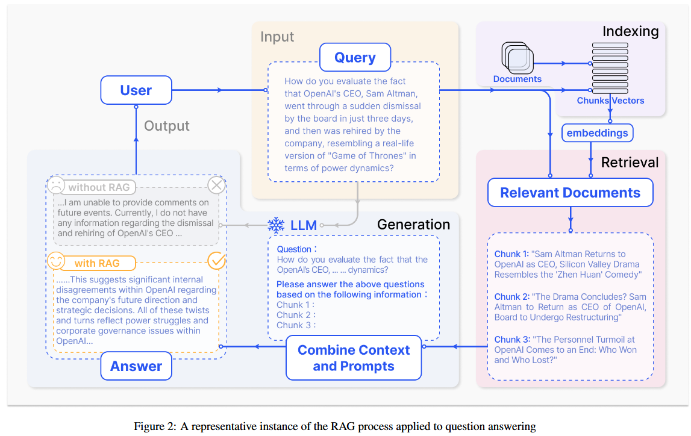
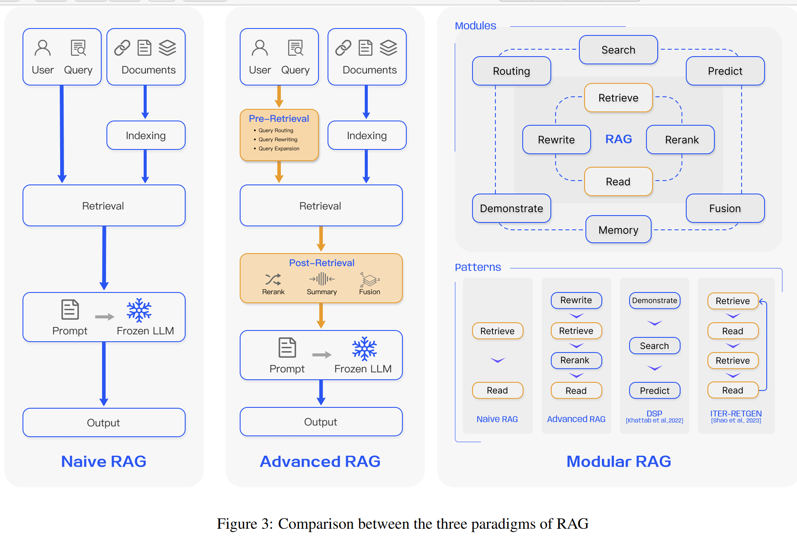

Basic Information:
- Paper: [Retrieval-Augmented Generation for Large Language Models: A Survey](https://arxiv.org/abs/2312.10997),（[中文翻译](https://baoyu.io/translations/ai-paper/2312.10997-retrieval-augmented-generation-for-large-language-models-a-survey))
- Author: Yunfan Gao et al.; *Institute: Tongji University & Fudan University*
- Time: 2023.12
- Abstraction: Large Language Models (LLMs) demonstrate significant capabilities but face challenges such as hallucination, outdated knowledge, and nontransparent, untraceable reasoning processes. Retrieval-Augmented Generation (RAG) has emerged as a promising solution by incorporating knowledge from external databases. This enhances the accuracy and credibility of the models, particularly for knowledge-intensive tasks, and allows for continuous knowledge updates and integration of domain-specific information. RAG synergistically merges LLMs’ intrinsic knowledge with the vast, dynamic repositories of external databases. This comprehensive review paper offers a detailed examination of the progression of RAG paradigms, encompassing the Naive RAG, the Advanced RAG, and the Modular RAG. It meticulously scrutinizes the tripartite foundation of RAG frameworks, which includes the retrieval , the generation and the augmentation techniques. The paper highlights the state-of-the-art technologies embedded in each of these critical components, providing a profound understanding of the advancements in RAG systems. Furthermore, this paper introduces the metrics and benchmarks for assessing RAG models, along with the most up-to-date evaluation framework. In conclusion, the paper delineates prospective avenues for research, including the identification of challenges, the expansion of multi-modalities, and the progression of the RAG infrastructure and its ecosystem[^githubcode].

# Outline

## Roadmap of RAG

- **2017(transformer)**: assimilating additional knowledge through Pre-Training Models(PTM) to augment language models. Main direction: optimizing _pre-training_ methodologies.
- **Post 2023(chatgpt is born)**: the lion's share of RAG endeavors concentrated on _inference_, with a miority dedicated to _fine-tunnig_ proccesses.
- **Post GPT-4**: RAG's emphasis evolved into a _hybrid_ approach, combining the strengths of RAG and fine-tuning, alongside a dedicated minority continuing the focus on optimizing pre-training methodologies. 

<u>By the way</u>, the concept of RAG is originally proposed in Mid-2020[^lewis2020].

In augmentation phase, pre-training and supervised fine-tuning are under conduction. However, in the time of LLM, **augmentation in  inference phase** are increasing, and this is because cost of high performance of LLM training is high. Researchers have tried to introduce the RAG module, to fuse the out-of-model knowledge into generation of models in a cost-effective way.

In the aspect of augment data using, early RAG focused on **non-structural** data application, especially in the environment of open-domain QA. With the time passing by, knowledge source of RAG retrieval are becoming more and more diverse, with high-quality data in it. With these data as source of knowledge, hallucination problem have been solved in some degree. Further more, RAG becomes to utilizing **structural knowledge**, such as KG. Recently, **self-retrieving** become the hotpot, which means leveraging the knowledge base of LLMs' self to enhance its own performance.

## Definition of RAG

Constrained by its pretraining data, LLM lacks knowledge of recent events. RAG addresses this gap by retrieving up-to-date document excerpts from external knowledge bases. And RAG's key advantage lies in its obviation of the need for retraining of LLMs for task-specific applications.

RAG's pivotal questions such as "what to retrieve", "when to retrieve" and "how to use the retrieved information"(*I think maybe this scenario includes the attribution of LLMs*).

1. For **what to retrieve**, research has progressed from *simple token*[^khandelwal19] and *entity retrival*[^nishikawa22] to more complex structures like *chunks*[^ram23] and *knowledge graph*[^kang23], *with* studies focusing on the granularity of retrieval and the level of data structuring. Coarse granularity brings more information but with lower precision.
2. For **when to retrieve**, strategies are ranging from *single*[^wang23e][^shi23] to *adaptive*[^jiang 23b][^huang23] and *multiple retrieval*[^izacard22] methods. Hige frequency of retrieval brings more information and lowert efficiency.
3. For **how to use** the retrieved data, *integration techniques have been developed across various levels of the model architecture, including the input[^khattab22], intermediate[^borgeaud22] and output layers[^liang23]*. Although the "intermediate" and "output layers" are more effective, there are problems with the need for training and low efficiency.

## RAG vs Fine-tuning

What is RAG? RAG is more like a text book that the model can find specific information according to specific questions. This method is suitable to answer any specific question or conduct specific information retrieval tasks. But RAG is not suitable for teaching the model to understand the extensive domains or learn new languages, formats and styles.

What's fine-tuning? Fine-tuning is more like making students absorbing information through extensive learning. It is more suitable for fine-tuning to augment the intrinsic knowledge, adapt or tailor the output of models, and give complex instructions to models. However, fine-tuning should not be used to add new knowledge to models, or use them in the background of fast iterations. 

|     Feature Comparison     | RAG                                                          | Fine-tuning                                                  |
| :------------------------: | ------------------------------------------------------------ | ------------------------------------------------------------ |
|     Knowledge Updates      | **Directly updating** the retrieval knowledge base ensures that the information *remains current* without the need for frequent retraining, making it well-suited for dynamic data environments. | Stores static data, **requiring retraining** for knowledge and data updates. |
|     External Knowledge     | Proficient in leveraging external resources, particularly suitable for accessing **documents or other structured/unstructured databases** | Can be utilized to align the external acquired knowledge **from pretraining**, with large language models, but may be less practical for frequently changing data sources. |
|      Data Processing       | Involves **minimal data processing and handling**            | Depends on the **creation of high-quality datasets**, and limited datasets may not result in significant performance improvements. |
|    Model Customization     | Focuses on information retrieval and integrating external knowledge but may **not fully customize model behavior or writing style** | **Allows adjustments of LLM behavior**, writing style, or specific domain knowledge based on specific tones or terms. |
|      Interpretability      | Responses can be **traced back to specific data sources**, providing higher interpretability and traceability. | Similar to a **black box**, it is not always clear why the model reacts a certain way, resulting in relatively lower interpretability. |
|  Computational Resources   | Depends on computational resources to **support retrieval strategies and technologies related to databases**. Additionally, it requires the maintenance of external data source integration and updates. | The preparation and curation of **high-quality training datasets, defining fine-tuning objectives, and providing corresponding computational resources** are necessary. |
|    Latency Requirements    | Involves data retrieval, which may lead to **higher latency** | LLM after fine-tuning can respond without retrieval, resulting in lower latency. |
|  Reducing Hallucinations   | Inherently **less prone to hallucinations** as each answer is grounded in retrieved evidence | Can help reduce hallucinations by training the model based on specific domain data but may **still exhibit hallucinations** when faced with unfamiliar input. |
| Ethical and Privacy Issues | Ethical and privacy concern arise from the storage and retrieval of text **from external databases** | Ethical and privacy concern may arise due to sensitive content in the **training data**. |

# RAG Paradigms

According to this survey, RAG can be categorized into 3 types: Naive RAG, Advanced RAG, and Modular RAG. While RAG were cost-effective and surpassed the performance of the native LLM, they also exhibited several limitations. And Advanced RAG and Modular RAG were to solve these shortcomings.

## Naive RAG

Naive RAG includes (1) Indexing, (2) Retrieval, (3) Generation

### Indexing

Indexing process is a crucial initial step in data preparation that occurs <u>offline</u> and involves several stages. 

(1) **Data indexing**: It begins with <u>data indexing</u>, where original data is <u>cleansed</u> and <u>extracted</u>, and various file formats such PDF, HTML, Word and Markdown are converted into standardized plain text. 

(2) **Chunking**: In order to fit within the context limitations of language models,  this text is then segmented into smaller, more manageable chunks in a process known as <u>chunking</u>.

(3) **Embedding and creating indexes**:  These chunks are subsequently <u>transformed into vector representations</u> through an embedding model, chosen for its balance between inference efficiency and model size. Finally, an index  is created to store these chunks and their vector embeddings as key-value  pairs, which allows for  efficient and scalable search capabilities.

### Retrieval

*Retrieval: (1) Transcode the input into a vector representation;(2) Compute the similarity scores between the query vector and the vectorized chunks within the indexed  corpus; (3) Prioritizing and retrieves the top K chunks.*

Upon receipt of a user query, the system employs *the same encoding model* utilized during the indexing phase to *transcode the input into a vector representation*. Then *compute the similarity scores between the query vector and the vectorized chunks within the indexed corpus.* The system *prioritizes* and *retrieves* the top K chunks that demonstrate the greatest similarity to the query. These chunks are subsequently used as the expanded contextual basis for addressing the user's request.

### Generation

*Generation:  Synthesize the posed  query and selected documents into a coherent prompt in a task-specific format.*

The model's approach to answering may vary *depending on task-specific criteria* (**I don't understand this**), allowing it to <u>either draw upon its inherent parametric knowledge or restrict its responses to the information contained within the provided documents.</u>(Actually this is the most important thing that great attention should be paid to) In cases of ongoing dialogues, *any existing conversational history can be integrated into the prompt*, enabling the model to engage in multi-turn dialogue interactions effectively.

### Drawbacks in Naive RAG

We dive into drawbacks in Naive RAG in 3 aspects: "Retrieval", "Generation", and "Augmentation".

**Retrieval quality** poses diverse challenges, including *<u>low precision</u>*, leading to misaligned retrieved chunks and potential issues like hallucination or mid-air drop. <u>*Low recall*</u> also occurs, resulting in the failure to retrieve all relevant chunks, thereby hindering the LLMs' ability to craft *comprehensive* responses. Outdated information further compounds the problem, potentially yielding inaccurate retrieval results. (These drawbacks also contribute in Attribution in LLMs) Response generation quality presents hallucination challenge, where the model generates answers not grounded in the provided context, as well as issues of irrelevant context and potential toxicity or bias in the model's output.

**Augmentation process presents  its own challenges in effectively integrating context from retrieved passages** with the current generation task, potentially leading to disjointed or incoherent output. (This is now what I am exploring about.) *Redundancy* and *repetition* are also concerns, especially *when multiple retrieved passages contain similar information, resulting in repetitive content in the generated response*. Further more, when content in different documents  conflicts with each other, or when content in the retrieved documents and those in the intrinsic parametric knowledge are conflict, then what should be done to alleviate the phenomenon? (:star: Extend the range of problems of multi-document content and intrinsic parametric knowledge from only CONFLICTS to Both CONFLICTS ,REPETITION and REDUNDANCY)

Lastly, **there's a risk of generation models *overly depending on augmented information***, potentially resulting in *outputs that merely reiterate the retrieved content without providing new value or synthesized information*. (:star: How to better balance the importance of intrinsic parametric knowledge and retrieved documents is an important problem to be solved. Sometimes we just need the intrinsic knowledge more.)

### Advanced RAG

:star2:There's a [conclusion of RAG advanced techniques](https://zhuanlan.zhihu.com/p/673392898) on Zhihu.

To address the *indexing challenges* experienced by Naive RAG, Advanced RAG has refined its indexing approach using techniques such as *sliding window, fine-grained segmentation, and metadata*. There is a paper talking about the advanced RAG techniques[^IVAN23]. And this survey talk about advanced RAG in two aspects.

#### Pre-Retrieval Process

<u>*Optimizing Data Indexing*</u> is to *enhance the quality of the content being indexed*. This involves five primary strategies: enhancing data granularity, optimizing index structures, adding metadata, alignment optimization, and mixed retrieval.

(1) **Enhancing data granularity**: By removing irrelevant information, dispelling ambiguity in entities and terms, confirming factual accuracy, maintaining context and updating outdated documents.

(2) **Optimizing index structures**: involves adjusting the size of chunks to capture relevant context, querying across multiple index paths, and incorporating information from the graph structure to capture relevant context by leveraging relationships between nodes in a graph data index.

(3) **Adding metadata information**: involves integrating referenced metadata, such as *dates* and *purposes*, into chunks for filtering purposes, and incorporating metadata like chapters and subsections of references to improve retrieval efficiency. (:star: Jifan Chen's work about the *Complex Claim Verification with Evidence Retrieved in the Wild*[^jifanchen])

(4) **Alignment optimization**: addresses alignment issues and disparities between documents  by introducing "hypothetical questions"[^li23d] into documents to rectify alignment issues and differences.(**:star:** This may be very important for solving problems caused by the conflict of multi documents.)

#### Retrieval

(1) **Fine-tuning Embedding**. ***Fine-tuning embedding models significantly impact the relevance of retrieved content in RAG systems, especially for domain-specific contexts.*** The BGE embedding model[^BAAI23] developed by BAAI, is an example of a high-performance embedding models that can be fine-tuned to optimize retrieval relevance. Training data for fine-tuning can be generated using language models like GPT-3.5-turbo to formulate questions grounded on document chunks, which are then used as fine-tuning pairs.

(2) **Dynamic Embedding**. <u>Dynamic Embedding adapts to the context in which words are used</u>, unlike static embedding, which uses a single vector for each word. Embedding should be different if one word is different from words around the same word.

#### Post-Retrieval Process

After retrieving valuable context from the database, it is essential to merge it with the query as an input into LLMs while addressing challenges posed by context window limits. (Simply presenting all relevant documents can exceed the context window limit of LLMs.)

(1) **Re-Ranking.** Re-ranking the retrieved information to relocate the most relevant content to the edges of the prompt is a key strategy.

(2) **Prompt Compression.** Research indicates that noise in retrieved documents adversely affects RAG performance. We mainly focus compressing context that is not necessary in order to highlight the key paragraph. Approaches such as Selective Context and LLMLingua utilize information or perplexity, estimating element importance. **Recomp[^xu23a] addresses this by training compressors at different granularities, while Long Context[^xu23b] and 'Walking in the Memory Maze'[^chen23a] design summarization techniques to enhance LLM's key information perception, particularly in dealing with extensive contexts**.

We can 

### Modular RAG

[^lewis2020]:Patrick Lewis, Ethan Perez, Aleksandra Piktus, Fabio Petroni, Vladimir Karpukhin, Naman Goyal, Heinrich K ̈ uttler, Mike Lewis, Wen-tau Yih, Tim Rockt ̈ aschel, et al. Retrieval-augmented generation for knowledge-intensive nlp tasks. Advances in Neural Information Processing Systems, 33:9459–9474, 2020.
[^githubcode]:[Tongji-KGLLM/RAG-Survey (github.com)](https://github.com/Tongji-KGLLM/RAG-Survey)
[^khandelwal19]:Urvashi Khandelwal, Omer Levy, Dan Jurafsky, Luke Zettlemoyer, and Mike Lewis. Generalization through memorization: Nearest neighbor language models. arXiv preprint arXiv:1911.00172, 2019.
[^nishikawa22]:Sosuke Nishikawa, Ryokan Ri, Ikuya Yamada, Yoshimasa Tsuruoka, and Isao Echizen. Ease: Entity-aware contrastive learning of sentence embedding. arXiv preprint arXiv:2205.04260, 2022.
[^ram23]:Ori Ram, Yoav Levine, Itay Dalmedigos, Dor Muhlgay, Amnon Shashua, Kevin Leyton-Brown, and Yoav Shoham. In-context retrieval-augmented language models. arXiv preprint arXiv:2302.00083, 2023.
[^kang23]:Minki Kang, Jin Myung Kwak, Jinheon Baek, and Sung Ju Hwang. Knowledge graph-augmented language models for knowledge-grounded dialogue generation. arXiv preprint arXiv:2305.18846, 2023.
[^wang23e]:Yile Wang, Peng Li, Maosong Sun, and Yang Liu. Self-knowledge guided retrieval augmentation for large language models. arXiv preprint arXiv:2310.05002, 2023.
[^shi23]:Weijia Shi, Sewon Min, Michihiro Yasunaga, Minjoon Seo, Rich James, Mike Lewis, Luke Zettlemoyer, and Wen-tau Yih. Replug: Retrievalaugmented black-box language models. arXiv preprint arXiv:2301.12652, 2023.
[^jiang 23b]:Zhengbao Jiang, Frank F Xu, Luyu Gao, Zhiqing Sun, Qian Liu, Jane Dwivedi-Yu, Yiming Yang, Jamie Callan, and Graham Neubig. Active retrieval augmented generation. arXiv preprint arXiv:2305.06983, 2023.
[^huang23]:Jie Huang, Wei Ping, Peng Xu, Mohammad Shoeybi, Kevin Chen-Chuan Chang, and Bryan Catanzaro. Raven: In-context learning with retrieval augmented encoder-decoder language models. arXiv preprint arXiv:2308.07922, 2023.
[^izacard22]:Gautier Izacard, Patrick Lewis, Maria Lomeli, Lucas Hosseini, Fabio Petroni, Timo Schick, Jane Dwivedi-Yu, Armand Joulin, Sebastian Riedel, and Edouard Grave. Few-shot learning with retrieval augmented language models. arXiv preprint arXiv:2208.03299, 2022.
[^khattab22]:Omar Khattab, Keshav Santhanam, Xiang Lisa Li, David Hall, Percy Liang, Christopher Potts, and Matei Zaharia. Demonstrate-search-predict: Composing retrieval and language models for knowledge-intensive nlp. arXiv preprint arXiv:2212.14024, 2022.
[^borgeaud22]:Sebastian Borgeaud, Arthur Mensch, Jordan Hoffmann, Trevor Cai, Eliza Rutherford, Katie Millican, George Bm Van Den Driessche, Jean-Baptiste Lespiau, Bogdan Damoc, Aidan Clark, et al. Improving language models by retrieving from trillions of tokens. In International conference on machine learning, pages 2206–2240. PMLR, 2022.
[^liang23]:Han Liang, Wenqian Zhang, Wenxuan Li, Jingyi Yu, and Lan Xu. Intergen: Diffusion-based multi-human motion generation under complex interactions. arXiv preprint arXiv:2304.05684, 2023.
[^IVAN23]:IVAN ILIN. Advanced rag techniques: an illustrated overview. https://pub.towardsai.net/ advanced-rag-techniques-an-illustrated-overview-04d193d8fec6, 2023.
[^jifanchen]:Chen J, Kim G, Sriram A, et al. Complex Claim Verification with Evidence Retrieved in the Wild[J]. arXiv preprint arXiv:2305.11859, 2023.
[^li23d]: Xinze Li, Zhenghao Liu, Chenyan Xiong, Shi Yu, Yu Gu, Zhiyuan Liu, and Ge Yu. Structure-aware language model pretraining improves dense retrieval on structured data. arXiv preprint arXiv:2305.19912, 2023.
[^BAAI23]:BAAI. Flagembedding. https://github.com/ FlagOpen/FlagEmbedding, 2023.
[^xu23a]:Fangyuan Xu, Weijia Shi, and Eunsol Choi. Recomp: Improving retrieval-augmented lms with compression and selective augmentation. arXiv preprint arXiv:2310.04408, 2023.
[^xu23b]:Peng Xu, Wei Ping, Xianchao Wu, Lawrence McAfee, Chen Zhu, Zihan Liu, Sandeep Subramanian, Evelina Bakhturina, Mohammad Shoeybi, and Bryan Catanzaro. Retrieval meets long context large language models. arXiv preprint arXiv:2310.03025, 2023.
[^chen23a]:Howard Chen, Ramakanth Pasunuru, Jason Weston, and Asli Celikyilmaz. Walking down the memory maze: Beyond context limit through interactive reading. arXiv preprint arXiv:2310.05029, 2023.