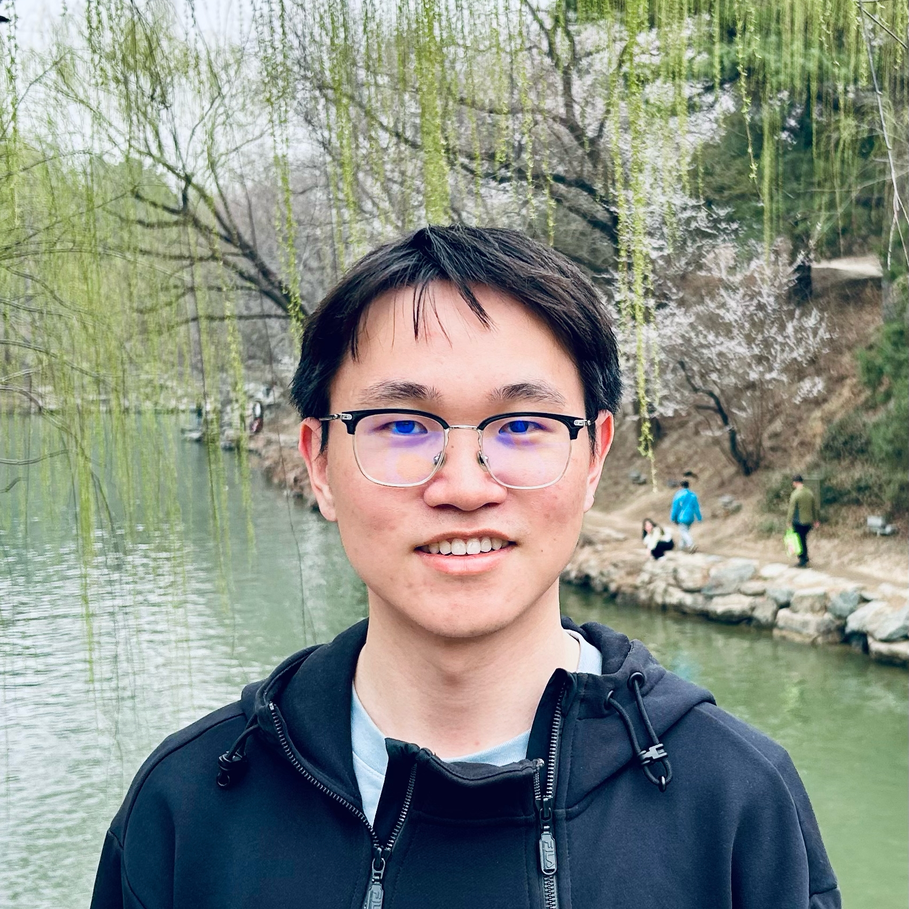

## About Me

I am a first-year Ph.D. student in Computer Science at [Peking University](https://www.pku.edu.cn), advised by Prof. [Houfeng Wang](https://scholar.google.com/citations?user=YCX4y1gAAAAJ&hl=zh-CN&oi=ao).

[GitHub](https://github.com/sylvain-wei) | [Twitter/X](https://x.com/veison02) | [Google Scholar](https://scholar.google.com/citations?user=wuzIV_kAAAAJ&hl=zh-CN&oi=ao) | [E-mail](shaohang@stu.pku.edu.cn)

## Research Interest

My research interests broadly span language modeling, with a particular focus on *post-training, alignment, and reasoning*. 

**I strive to understand the learning behaviors of LLMs, and seek ways to push the boundaries of reasoning ability and enable LLMs to generalize across multiple domains.**

## Publications

1. F.Bar, J.Doe: Effects of having a placeholder of a name
2. S.Holmes, J.Watson: Consequences of living with a sociopath in London

## Typography

This is a [link](http://google.com). Something *italics* and something **bold**.

Here is a table

Year | Award | Category
-----|-------|--------
2014 | Emmy  | Won Outstanding Lead Actor in a miniseries or a movie
2015 | BAFTA | Nominated for Best Leading Actor for Sherlock
2014 | Satellite | Won Best Actor miniseries or television film

Here is a horizontal rule

---

Here is a blockquote

> To a great mind, nothing is little

## References

* Foo Bar: Head of Department, Placeholder Names, Lorem
* John Doe: Associate Professor, Department of Computer Science, Ipsum
